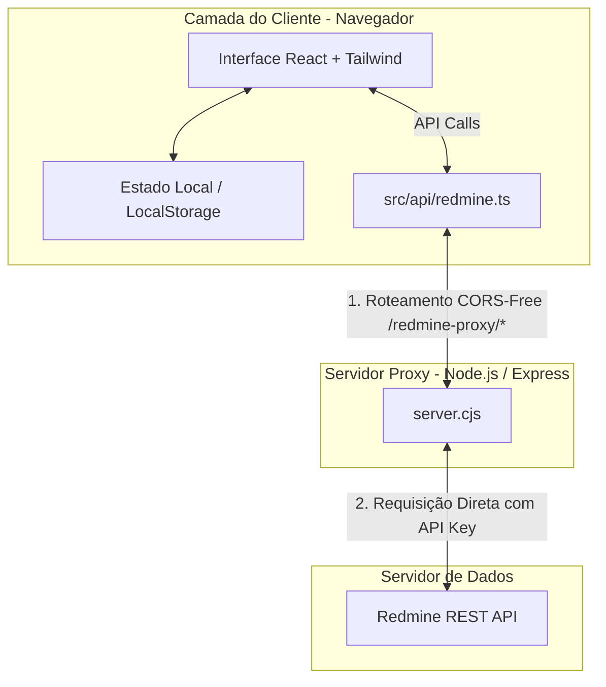

# 🏛️ Especificação de Arquitetura Técnica — RedLevels

O **RedLevels** é uma aplicação corporativa moderna desenvolvida em **React**, **TypeScript** e **Node.js** projetada para servir como uma camada de visualização dinâmica e gestão baseada em **Flight Levels** integrada em tempo real com o **Redmine**. 

Este documento serve como referência técnica detalhada sobre a arquitetura do sistema, fluxos de dados, padrões de sincronização e estrutura de componentes.

---

## 1. Visão Geral da Arquitetura

O sistema adota uma arquitetura de cliente leve com um servidor proxy reverso acoplado para mitigar restrições de CORS comuns em integrações com o Redmine corporativo.



### Componentes de Infraestrutura:
1.  **Frontend (SPA):** Construído com React 18 e empacotado pelo Vite. Toda a lógica de negócio, processamento de métricas e filtros é executada localmente no cliente (Client-Side).
2.  **Servidor Proxy (`server.cjs`):** Um mini-servidor Express em Node.js. Ele desempenha duas funções cruciais:
    *   **Em Desenvolvimento:** Serve como bypass de CORS para requisições direcionadas a servidores Redmine locais ou on-premise.
    *   **Em Produção:** Serve os assets compilados do diretório `/dist` e atua como o ponto de entrada único do aplicativo.

---

## 2. Fluxo de Sincronização & Proxy CORS

Uma das maiores barreiras na integração de ferramentas de terceiros ao Redmine corporativo é a política de segurança de mesma origem (CORS) do navegador. O Redmine raramente é configurado com cabeçalhos `Access-Control-Allow-Origin` permissivos em redes corporativas.

### O Mecanismo de Proxy Dinâmico
Para evitar a necessidade de configurar previamente cada URL de servidor de cliente no proxy, o RedLevels implementa um roteador dinâmico codificado no próprio path:

```
URL Solicitada:   /redmine-proxy/https%3A%2F%2Fredmine.empresa.com/users/current.json
                             └────────────────────────┬──────────────────────┘
                                          URL Real Codificada (URI Component)
```

O proxy (`server.cjs`) intercepta esta rota, decodifica o primeiro segmento para extrair a base URL do Redmine, e recria a requisição HTTP usando as bibliotecas nativas `http` ou `https` do Node.js.

> [!IMPORTANT]
> **Segurança em Conexões Corporativas:** O proxy é configurado com `rejectUnauthorized: false`. Isso permite que o RedLevels se conecte de forma transparente a servidores Redmine instalados em redes locais rodando sob certificados HTTPS auto-assinados (on-premise), muito comum em grandes corporações.

---

## 3. Estrutura e Modelagem de Dados

O aplicativo utiliza um mapeador de dados (Data Mapper) em [redmine.ts](file:///Users/shermanmota/Downloads/workspace/redlevel/RedLevel/src/api/redmine.ts) para traduzir o modelo de dados padrão de issues do Redmine para as entidades semânticas de Flight Levels do sistema.

### Principais Tipos de Dados

O RedLevels é fortemente tipado em [types.ts](file:///Users/shermanmota/Downloads/workspace/redlevel/RedLevel/src/types.ts). Os contratos de dados mais fundamentais são descritos abaixo:

#### A. Entidade `Issue`
Representa um cartão dinâmico exibido nos Flight Boards.

| Propriedade | Tipo | Descrição |
| :--- | :--- | :--- |
| `id` | `string` | ID único da tarefa no Redmine. |
| `subject` | `string` | Título da tarefa. |
| `level` | `FlightLevel` | Nível de voo associado (`L3`, `L2` ou `L1`). |
| `status` | `KanbanStage` | Estado Kanban mapeado (`Backlog`, `To Do`, `In Progress`, `Done`). |
| `blocked` | `boolean` | Flag indicando se a entrega está travada por algum impedimento. |
| `blockedReason`| `string` | Descrição do impedimento. |
| `team` | `string` | Squad, time ou área responsável pelo fluxo. |
| `age` | `number` | Idade ativa do cartão (dias úteis fora de Backlog e Done). |

#### B. Entidade `Dependency`
Representa conexões de fluxo e rotas críticas mapeadas no grafo de dependências.

```typescript
export interface Dependency {
  id: string;
  sourceId: string; // Cartão que está aguardando (filho ou dependente)
  targetId: string; // Cartão de origem (pai ou causador do bloqueio)
  type: 'blocked-by' | 'parent-child';
}
```

---

## 4. Otimização de Performance no Fetching

Para garantir que a aplicação possa ser usada em corporações com dezenas de milhares de tarefas no Redmine sem causar gargalos na rede ou timeouts de banco de dados, o processo de sincronização implementa duas estratégias de otimização em [redmine.ts](file:///Users/shermanmota/Downloads/workspace/redlevel/RedLevel/src/api/redmine.ts):

### 1. Filtragem Nativa Indexada (Database-Side Filter)
Em vez de baixar todas as issues ativas do Redmine para depois filtrá-las no navegador, o RedLevels realiza um handshake inicial em duas etapas:
1.  Busca a lista de IDs de trackers cadastrados via `/trackers.json`.
2.  Associa os trackers configurados pelo usuário nos níveis L3, L2 e L1 com seus respectivos IDs numéricos.
3.  Executa a chamada principal de issues passando o parâmetro `tracker_id=X,Y,Z` na URL. Isso força o banco de dados do Redmine a fazer a indexação e retornar apenas os dados válidos, economizando largura de banda.

### 2. Paginação em Lote com Trava de Segurança
A busca é feita de forma paginada usando parâmetros `limit=100` e `offset=N` em um loop assíncrono controlado. Para proteger o servidor Redmine de requisições infinitas em caso de base massiva desconfigurada, há uma trava de segurança que encerra a busca automaticamente ao atingir 5.000 registros indexados.

---

## 5. Mapeador de Ciclos de Vida (State Mapping Engine)

Como o Redmine possui fluxos de status altamente customizáveis (onde cada empresa define seus próprios nomes e fluxos de transição), o RedLevels traduz esta complexidade para 4 raias universais de agilidade.

O fluxo de conversão é definido pela configuração `stagesMap`:

```
[Status do Redmine] ───► ( Stages Map Parser ) ───► [Raia Kanban no RedLevels]
  - "Nova" ────────────────────────────────────────► Backlog
  - "Em Discussão" ────────────────────────────────► To Do
  - "Aprovada" ────────────────────────────────────► To Do
  - "Em Desenvolvimento" ──────────────────────────► In Progress
  - "Bloqueada" ───────────────────────────────────► In Progress
  - "Resolvida" ───────────────────────────────────► Done
```

Se um status não estiver explicitamente configurado no mapeador do usuário, o motor executa uma lógica preditiva de fallback baseada em análise de strings (`toLowerCase().includes()`) para deduzir o destino correto (ex: se o status contém `"teste"`, associa a `In Progress`; se contém `"fechado"`, associa a `Done`).

---

## 6. Design System & Tokens Visuais

O design visual é estruturado sob o conceito de **Enterprise Corporate Red Palette**, implementado via **Tailwind CSS v4**. O layout prioriza o conforto visual prolongado em ambientes corporativos e clareza profunda de dados.

### Paleta de Cores e Tokens CSS:
*   **Fundo Principal (Light Mode):** Tons leves off-white (`#fcfafb` a `#f3f0f2`) que minimizam a fadiga ocular.
*   **Destaque Corporativo Principal:** Vermelho Vinho Premium (`#8a2d46`) para marcas estruturais e botões de destaque.
*   **Destaques Secundários:** Acentos de rosa corporativo suave e bordas estilizadas para segmentações ativas.
*   **Decoração de Métricas:** Cores de Agilidade Clássicas (Azul suave para Backlog, Cinza para To Do, Laranja/Âmbar para In Progress, Verde esmeralda limpo para Done).

### Micro-interações com Motion
O sistema utiliza a biblioteca **Motion** para animar transições de navegação e manipulação de cartões:
*   **Animação de Abas:** Indicadores flutuantes nas mudanças de visualização do Hub principal.
*   **Filtros Dinâmicos:** Esmaecimento suave e reordenação com física realista ao aplicar filtros na barra lateral.
*   **Gavetas Laterais:** Slide-in lateral para visualização de detalhes, mantendo o contexto espacial do fluxo.
