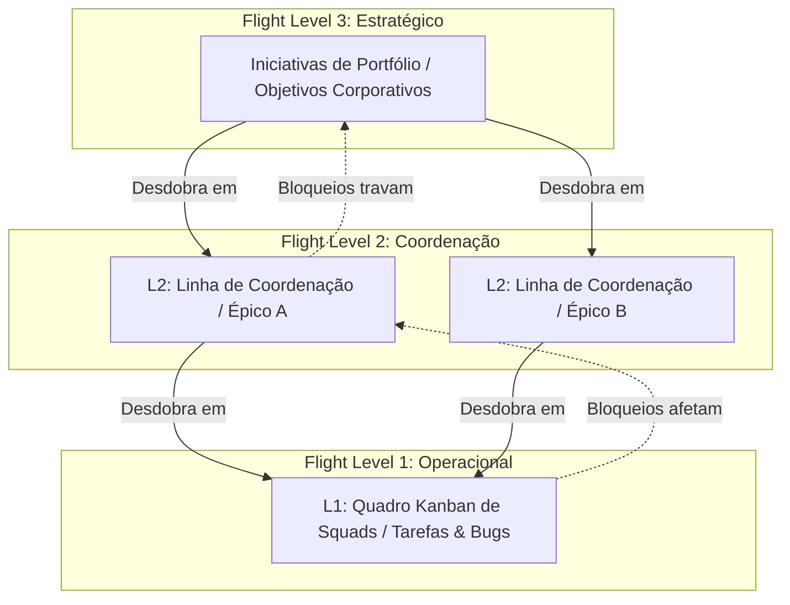

# 📄 Documento de Requisitos do Produto (PRD) — RedLevels

## 1. Visão Geral do Produto

O **RedLevels** é um sistema corporativo de gestão visual e métricas baseado na metodologia de **Flight Levels**, integrada de forma direta e configurável com o **Redmine** via API. 

Muitas organizações utilizam o Redmine para registrar e gerenciar o trabalho diário de desenvolvimento, suporte e operação, porém carecem de uma visão unificada e top-down que conecte a estratégia corporativa aos times de entrega. O RedLevels soluciona esse problema fornecendo painéis interativos de alta densidade estruturados em três níveis de voo, garantindo alinhamento e fluxo contínuo de ponta a ponta na organização.

---

## 2. Abordagem de Flight Levels Adotada

A arquitetura de visualização e agrupamento baseia-se nos três níveis clássicos da metodologia Flight Levels de Klaus Leopold. O sistema mapeia os fluxos da seguinte forma:

### Detalhamento dos Níveis de Voo

#### 🚀 Flight Level 3: Estratégico (Iniciativas de Portfólio)
*   **Propósito:** Direcionar o rumo corporativo e monitorar a saúde de grandes iniciativas, metas anuais e objetivos estratégicos de grande impacto.
*   **Comportamento:** Cartões agregados de alto nível. Comunica bloqueios de grande risco para o negócio de forma destacada em tonalidades de alerta.

#### 🔄 Flight Level 2: Coordenação (Fluxos de Valor e Sincronização)
*   **Propósito:** Sincronizar múltiplos times que compartilham o mesmo fluxo de valor ou que possuem dependências cruzadas complexas.
*   **Comportamento:** Suporte a raias horizontais (*Swimlanes*) parametrizáveis pelo campo customizado configurado (ex: Área de Negócio, Produto ou Squad Principal). Exibe dependências ativas e gargalos.

#### ⚙️ Flight Level 1: Operacional (Quadros de Times)
*   **Propósito:** Visualização granular das tarefas diárias, bugs e sprints operacionais das equipes de execução.
*   **Comportamento:** Quadro Kanban tradicional de alta densidade com recursos de compactação visual automática e exibição de dot matrix para simular grandes cargas operacionais agregadas.

---

## 3. Arquitetura de Integração Redmine

Diferente de ferramentas proprietárias que geram silos de informação, o RedLevels funciona como uma camada de exibição interativa e inteligente sobre o Redmine:

### A. Mapeador de Trackers por Nível de Voo
O administrador associa quais IDs ou nomes de trackers (ex: *Iniciativa*, *Épico*, *Tarefa*, *Bug*) pertencem a cada nível de voo correspondente nas configurações de sincronia.

### B. Mapeador de Ciclos e Estágios Kanban (Stages Map)
Abstração dos diferentes fluxos de estados do Redmine (*Novo*, *Em Resolução*, *Aprovado*, *Pendente*, *Fechado*) em 4 colunas universais de progresso ágil:
1.  **Backlog:** Itens planejados que aguardam priorização.
2.  **To Do:** Itens priorizados prontos para início imediato.
3.  **In Progress:** Itens em execução ativa ou teste.
4.  **Done:** Entregas concluídas.

### C. Campos Customizados Avançados
O RedLevels interpreta os valores de campos personalizados configurados no Redmine para enriquecer o fluxo sem exigir a modificação da base de dados nativa do Redmine:
*   **Impedimentos:** Campos do tipo `blocked` (Sim/Não) e `blockedReason` para alertar sobre travamentos de fluxo.
*   **Squad Responsável:** Campo para identificar o time (`team`) executor.
*   **Agrupador de Raias:** Campo agregador para separar o Flight Level 2 em raias (`groupingField`).

---

## 4. Requisitos de Interface e Estabilidade de Fluxo

*   **Paleta Corporativa Light & Clara (Red Premium):**
    Interface com foco em legibilidade profunda, abandonando temas escuros poluídos em prol de tons elegantes de off-white e cinza, destacados por bordas finas com contornos em vermelho corporativo (`#8a2d46`) e tons de rosa suave.
*   **Painel Flutuante de Detalhes (Drawer):**
    Ao clicar em qualquer cartão de nível de voo, o usuário visualiza uma gaveta detalhada contendo o log histórico de movimentação (*lead time tracker*), campos customizados agregados e opções de atualização de status.
*   **Restrições de Escrita e Integridade:**
    *   **Sync Estrito:** Conforme regra de sync estrita e integridade transacional, a inclusão de novos itens diretamente pelo painel está desabilitada. Novas demandas devem ser geradas no Redmine e sincronizadas automaticamente no RedLevels.
    *   **Transição de Status:** A movimentação de cartões entre colunas atualiza instantaneamente o status do item correspondente no Redmine via API (quando integrado).

---

## 5. Matriz de Métricas Disponíveis

O painel de métricas corporativas agrupa e plota os seguintes relatórios em tempo real:

*   **Distribuição de Lead Time:** Histograma quantitativo detalhando o número de dias que as tarefas levaram desde o status de início parametrizado (ex: "Em Desenvolvimento") até a conclusão ("Done").
*   **Throughput Histórico:** Volume agregador de itens concluídos por intervalo semanal/mensal para análise de vazão histórica dos times.
*   **WIP Age Ativo:** Monitoramento estrutural do tempo de permanência de cartões nas colunas intermediárias (`To Do` e `In Progress`) para sinalizar envelhecimento anormal de itens da fila operativa.
*   **Cumulative Flow Diagram (CFD):** Visualização de acúmulo de gargalos em colunas intermediárias ao longo do tempo, auxiliando gerentes a estabilizarem o fluxo de entrega.
