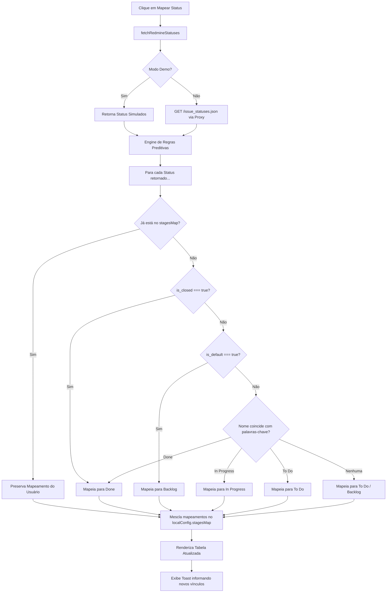

# 📄 Especificação de Design — Assistente de Mapeamento Automático de Status

Este documento registra a especificação de arquitetura e design técnico para o **Assistente de Configuração Rápida de Status** do RedLevels, baseado no processo de brainstorming concluído com sucesso.

---

## 1. Visão Geral (Understanding Summary)

O **RedLevels** exige que cada status do Redmine esteja mapeado para um dos 4 estágios universais do Kanban (`Backlog`, `To Do`, `In Progress`, `Done`). Este assistente elimina a configuração manual através de um botão *"Detectar e Mapear Automaticamente"* que consome a API do Redmine, analisa os status e aplica regras inteligentes de classificação.

### Restrições e Premissas:
*   **Contorno de CORS**: Toda chamada transita pelo proxy `/redmine-proxy/` sem requisições diretas a URLs externas.
*   **Integridade de Configurações**: O assistente **preserva** mapeamentos já customizados pelo usuário.
*   **Resiliência**: Falhas de rede ou bloqueios CORS exibem avisos claros de diagnóstico, sem congelar a aplicação.

---

## 2. Diário de Decisões (Decision Log)

*   **Decisão 1: Abordagem de Interface**
    *   *Opção Escolhida*: **Abordagem 1 — Mapeamento Preditivo com Integração Direta na Tela**.
    *   *Por que foi escolhida*: YAGNI ruthlessly. Evita a criação de modais de Wizard desnecessários, injetando os dados na própria tabela existente em tempo real para edição direta.
*   **Decisão 2: Motor de Mapeamento Preditivo**
    *   *Opção Escolhida*: Fusão de regras estruturais (`is_default`, `is_closed`) e análise semântica de palavras-chave.
    *   *Por que foi escolhida*: Alta taxa de acerto inicial em Redmines corporativos em português e inglês.

---

## 3. Especificação de Fluxo e Algoritmo



### Regras de Mapeamento (Motor Preditivo)

```typescript
const lowerName = status.name.toLowerCase();

if (status.is_closed) return 'Done';
if (status.is_default) return 'Backlog';

if (lowerName.includes('resolv') || lowerName.includes('fech') || lowerName.includes('done') || lowerName.includes('conclu') || lowerName.includes('rejeit') || lowerName.includes('entreg')) {
  return 'Done';
}

if (lowerName.includes('desen') || lowerName.includes('prog') || lowerName.includes('andam') || lowerName.includes('doing') || lowerName.includes('test') || lowerName.includes('homolog') || lowerName.includes('valida') || lowerName.includes('review') || lowerName.includes('revis') || lowerName.includes('imped') || lowerName.includes('bloq')) {
  return 'In Progress';
}

if (lowerName.includes('todo') || lowerName.includes('aprov') || lowerName.includes('prior') || lowerName.includes('discuss') || lowerName.includes('analis') || lowerName.includes('planej')) {
  return 'To Do';
}

return 'To Do'; // Fallback padrão
```
